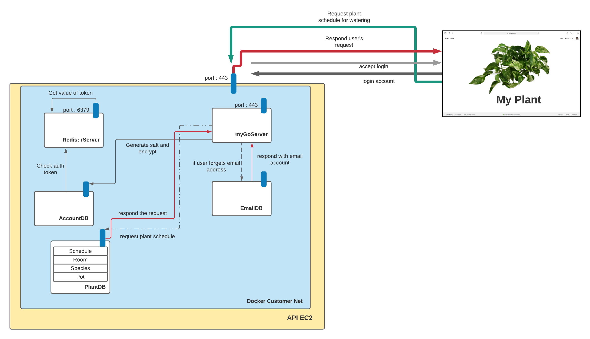

# INFO441 - Plant Helper

### Eric Gabrielson, Hailey Meister, Jisu Kim, Thomas That

## Project Description

Our application will help users track their care for their houseplants. We do think that everyone could benefit from and find a use for this application, but our target audience is students and busy professionals.

So often, people forget to water their plants or don't know how often to water the specific plant. Of course our target users could just look up this information about their plants online and set reminders on their phone. But our application brings these features together and more to make information more accessible and faster to find and record. 

As busy college students ourselves we understand the difficulty people face while caring for houseplants so we wanted to build an application that would not only benefit us but other busy people as well. Everyone could use a little plant in their life but oftentimes the care needed stops people, since they have a bad track record with caring for plants. This application will help the people who want plants, but don't think they can keep them alive, or care for them properly.

## Technical Description

### Architectural Diagram

### User Stories
| Priority | User | Description |
| --- | --- | --- |
| P0 | As a user | I want to see the status of my plants that shows if it needs to be watered |
| P0 | As a user | I want to see a list of all my plants that I've added |
| P0 | As a user | I want to add new plants to my account with different watering schedules |
| P0 | As a user | I want to see when was the last time and when is the next time I need to water the plant |
| P1 | As a user | I want to track when my plant was last fertilized |
| P1 | As a user | I want to know how much water is needed for each plant |
| P1 | As a user | I want to list other information about the plant such as placement, pot size, etc. |
| P2 | As a user | I want to filter out the plants by certain traits like fruits, flowers, etc. |
| P2 | As a user | I want to search for a single plant from my list |
| P3 | As a user | I want to upload images of my plants to capture their growth |

### Technical Implementations
- To show when the plants need watering, we'll have a timer that goes down based on the water interval that the user provides and when it reaches the end, it will show a status that says "Needs watering"
- We'll have a **MySQL** database to store a table that holds information about each plant connected through a **Docker** network
- We'll connect to the database and add Plant structs to the DB
- We'll have timestamps of when the last watering was and use the water interval to calculate the next time the plant will need watering
- We'll have timestamps for the last fertilization as well
- We plan to experiment a plant API called **Trefle** to acquire any more information about a certain plant
- We'll have fields in both our structs and the DB to include information like placement or pot size that user wants to add
- We'll set up a function to grab only the rows of our DB that meet the criteria of the filter
- We'll set up a search bar to do the same thing
- If there is still time, we may add a microservice to our API to store images on

## Endpoints

| Method | Path           | Use Case                                                     |
| :----: | -------------- | ------------------------------------------------------------ |
|  GET   | /plant/{id}    | Retrieve the details of a plant from the user's inventory    |
| PATCH  | /plant/{id}    | Update plant history (i.e. last watered, last fertilized)    |
|  POST  | /plant/        | Add a new plant to the user's inventory for tracking         |
| DELETE | /plant/{id}    | Remove a plant from the user's inventory                     |
|  GET   | /schedule/{id} | Retrieve details about the user's watering or fertilizing schedules |
|  POST  | /schedule/     | Create a new watering or fertilizing schedule for a user     |
|  POST  | /user          | Create a new user                                            |
|  GET   | /users/{id}    | Retrieve a user profile                                      |
|  POST  | /sessions      | Begin a new user session                                     |
| DELETE | /sessions/{id} | Delete a user session                                        |
